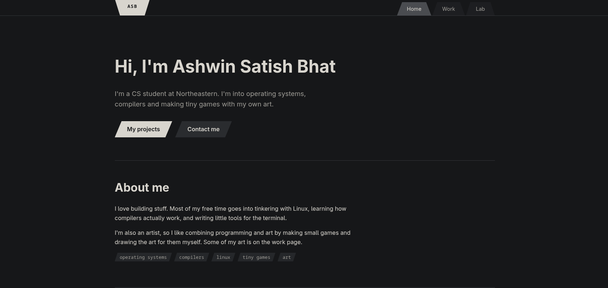
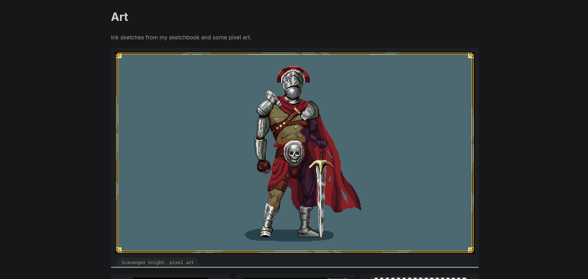
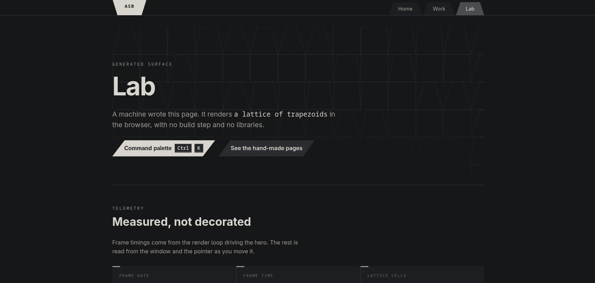

# Ashwin's Personal Home Page

A front-end only personal website built with plain HTML, CSS and ES6 modules.
The visual language is built from trapezoids, hard edges and a muted palette.

- **Author:** Ashwin Satish Bhat
- **Course:** [CS5610 Web Development](https://johnguerra.co/classes/webDevelopment_online_fall_2026/index.html),
  Northeastern University

## Objective

Build a personal home page that runs entirely in the browser: no backend, no
component libraries, no build step. It has to hold real information about me
and my work, be organised well enough that someone else can find their way
around the source, and include an original component of my own rather than a
stock template.

The site is three pages:

- **Home** — who I am, what I'm learning, and the projects I care about.
- **Work** — the full project write-ups, plus my ink sketches and pixel art.
- **Lab** — a deliberately AI-generated page, kept next to the hand-written
  ones so the two can be compared. It runs a canvas lattice, live telemetry
  and a command palette.

The original component is a set of vim motions that work across the whole
site: `h` and `l` move between pages, `gg` returns to the top, and `?` opens
the shortcut list. The page order is read out of the navigation itself, so the
shortcuts can't drift out of step with the site. The idea comes from
[learn.nvim](https://github.com/bash-win/learn.nvim), a Neovim plugin I wrote
for practising motions.

## Screenshots

### Home



### Work



### Lab



## Running it locally

```sh
npm install
npm start
```

`npm start` serves the folder at <http://localhost:3000>. A server is needed
rather than opening `index.html` directly: browsers refuse to load ES modules
over `file://`.

## Scripts

| Script                 | What it does                     |
| ---------------------- | -------------------------------- |
| `npm start`            | Serve the site on a local port   |
| `npm run lint`         | ESLint over the JavaScript       |
| `npm run format`       | Format everything with Prettier  |
| `npm run format:check` | Check formatting without writing |

## Structure

- `css/` — stylesheets, one per page plus the shared base, layout and
  components
- `js/` — ES6 modules; the Lab page's modules live in `js/ai/`
- `images/` — the favicon, my artwork in `images/art/`, and screenshots

## License

MIT
